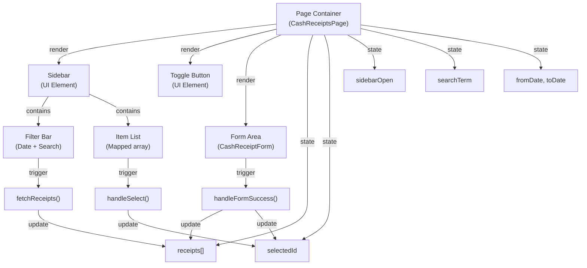

# 🏗️ BLUEPRINT: Master-Detail Module Layout Pattern
## Tiêu chuẩn Kiến trúc cho các module Phiếu (Receipt/Payment/Transaction)

**Phiên bản:** 1.0  
**Ngày:** 28/02/2026  
**Tác giả:** Software Architect  
**Trạng thái:** Ready for Production

---

## 📌 Executive Summary

Bản Blueprint này định nghĩa **chuẩn kiến trúc cho các module dạng "Phiếu"** trong ACCHM ERP (Cash Receipt, Cash Payment, Bank Transaction, Journal Entry, v.v). 

Được rút ra từ triển khai thành công của **module Phiếu Thu (Cash Receipt)**, Blueprint này bao gồm:
- ✅ Kiến trúc giao diện (Component Breakdown)
- ✅ Luồng dữ liệu (Data Flow Architecture)
- ✅ Hợp đồng cam kết (Non-Negotiable Standards)

**Mục đích:** Đội Builder AI có thể dùng Blueprint này làm "công thức" để thi công các module tương tự mà:
- 🎯 Không lệch khỏi chuẩn
- ⚡ Đảm bảo consistency (tính đồng bộ)
- 🛡️ Giảm thiểu lỗi, tăng chất lượng
- 📈 Tăng tốc độ phát triển

---

## A. KIẾN TRÚC COMPONENT (UI COMPONENTS BREAKDOWN)

### A.1 Sơ đồ Cấu trúc Tổng Thể

```
┌─────────────────────────────────────────────────────────────┐
│                    Page Component                          │
│  (State holder: receipts[], selectedId, filters)           │
├─────────────────────────────────────────────────────────────┤
│                                                             │
│  ┌──────────────────┐    ┌──────────────────────────────┐  │
│  │    SIDEBAR       │    │      MAIN FORM AREA          │  │
│  │  (List View)     │    │  (CashReceiptForm component)│  │
│  │                  │    │                              │  │
│  │ • Filter Bar     │    │ • Form fields (4 essential)  │  │
│  │ • Date Range     │    │ • Action buttons             │  │
│  │ • Search Box     │    │ • Status indicator           │  │
│  │ • Item List      │    │ • Preview / Confirmation     │  │
│  │ • Selection UI   │    │                              │  │
│  │                  │    │                              │  │
│  └──────────────────┘    └──────────────────────────────┘  │
│         ↑                           ↑                       │
│         └───────────────────────────┘                       │
│          (Two-way binding via state)                        │
│                                                             │
└─────────────────────────────────────────────────────────────┘
```

### A.2 Component Inventory

#### **A.2.1 Page Container (Master-Detail Host)**

| Yếu tố | Chi tiết | Trách nhiệm |
|--------|---------|-----------|
| **Tên Component** | `CashReceiptsPage` (hoặc `{ModuleName}Page`) | Trang chính module |
| **Loại** | Client Component (`'use client'`) | Xử lý state + interactivity |
| **State Quản Lý** | • `receipts: CashReceipt[]`<br/>• `selectedId: string \| null`<br/>• `sidebarOpen: boolean`<br/>• `searchTerm: string`<br/>• `fromDate, toDate: string` | Tập trung quản lý state để đơn giản |
| **Layout** | Flexbox 2 cột (Sidebar + Main) | Responsive, sidebar collapsible |
| **Height** | `height: 100%` | Full viewport |
| **Overflow** | Main area: `overflow: hidden` | Sidebar: `overflowY: auto` |

---

#### **A.2.2 Sidebar Component (List + Filter)**

| Yếu tố | Chi tiết | Mục đích |
|--------|---------|---------|
| **Vị trí** | Trái, chiều rộng `240px` (khi mở) | Navigation & Selection |
| **Collapse** | `width: sidebarOpen ? '240px' : '0px'` | UX: Tối ưu không gian |
| **Content Sections** | 1️⃣ Filter bar<br/>2️⃣ Danh sách item<br/>3️⃣ Selection indicator | Phân tách rõ ràng logic |
| **Styling** | `backgroundColor: var(--surface)`<br/>`borderRight: 1px solid var(--border)` | Delineation rõ ràng |
| **Z-Index** | Auto (static layout) | Không floating/modal |

**Sub-components:**

##### **A.2.2.1 Filter Bar**

```
┌─────────────────────────────┐
│  Từ ngày | Đến ngày | 🔍     │
│ [........] [........] [....] │
└─────────────────────────────┘
```

| Yếu tố | Quy cách | Mục đích |
|--------|---------|---------|
| **Padding** | `8px` (p-2) | Khoảng cách nội bộ vùng filter |
| **Bố cục** | `display: flex`, `gap: 4px` | Xếp hàng ngang "Từ ngày" và "Đến ngày" |
| **Label** | `10px`, `color: var(--text-secondary)` | Gọn gàng, tiết kiệm diện tích dọc |
| **Input Date** | `height: 32px`, `fontSize: 11px`, `padding: 4px` | Tối ưu cho diện tích sidebar hẹp |
| **Search Box** | `height: 32px`, `fontSize: 14px`, `paddingLeft: 32px` | Icon kính lúp cách lề trái `8px` |

**Trị số mặc định:**
- `fromDate`: Ngày 1 của tháng hiện tại
- `toDate`: Ngày cuối của tháng hiện tại
- `searchTerm`: ""

**Validation:**
- Date: Client-side (HTML5 native)
- Search: No validation (client-side substring match)

---

##### **A.2.2.2 Item List (Danh Sách Phiếu)**

```
┌─────────────────────────┐
│  PT-2026-00001  28/02  │ ← Row 1: Number (bold) + Date (muted)
│  ABC Ltd               │ ← Row 2: Partner Name (gray)
│           1,000,000 đ  │ ← Row 3: Amount (bold, right)
└─────────────────────────┘
```

| Row | Content | Styling |
|-----|---------|---------|
| 1 | Number + Date | `display: flex`, `justify-content: space-between`, `margin-bottom: 4px` |
| | - Number | `fontSize: 12px`, `fontWeight: bold` |
| | - Date | `fontSize: 10px`, `color: var(--text-muted)` |
| 2 | Name | `fontSize: 11px`, `color: var(--text-secondary)`, `truncate` |
| 3 | Amount | `fontSize: 12px`, `fontWeight: bold`, `text-align: right` |

**Quy cách Padding:**
- Item box: `padding: 12px`
- Border bottom: `1px solid var(--border)`

**Selection State:**
- Selected: `backgroundColor: rgba(var(--primary-rgb), 0.1)` + `borderLeft: 2px solid var(--primary)`
- Hover: `backgroundColor: rgba(var(--text-primary-rgb), 0.05)`

---

#### **A.2.3 Sidebar Toggle Button**

| Yếu tố | Chi tiết |
|--------|---------|
| **Vị trí** | Floating ở trái của main area (40px width) |
| **Visibility** | Show khi `!sidebarOpen` |
| **Icon** | Chevron right (SVG) |
| **Action** | Click → `setSidebarOpen(true)` |
| **Styling** | Minimal: transparent bg, border right |

---

#### **A.2.4 Main Form Area (Child Component)**

| Yếu tố | Chi tiết | Ghi chú |
|--------|---------|--------|
| **Component** | `<CashReceiptForm ... />` | External component (imported) |
| **Props** | • `id?: string`<br/>• `onSuccess: (action, data) => void`<br/>• `onCancel: () => void` | Decoupled via props |
| **Key** | `key={selectedId \|\| 'new'}` | Force re-mount on selection change |
| **Layout** | `flex: 1`, `overflow: hidden` | Takes remaining space |
| **Responsibility** | Form validation, submission, PDF generation | Không handle list |

**Pass-through from parent:**

```javascript
<CashReceiptForm
  key={selectedId || 'new'}           // Force unmount if ID changes
  id={selectedId}                     // undefined = "New" mode
  onSuccess={handleFormSuccess}       // (action, data) => refetch + update selection
  onCancel={() => setSidebarOpen(...)} // Cancel shouldn't clear list
/>
```

**Return value (`onSuccess`):**

```typescript
handleFormSuccess(action: 'save' | 'delete', data?: { id: string; ... }) {
  fetchReceipts();
  if (action === 'delete' || action === 'new') setSelectedId(null);
  else if (action === 'save' && data?.id) setSelectedId(data.id);
}
```

---

### A.3 Component Relationship Diagram



---

## B. LUỒNG DỮ LIỆU (DATA FLOW ARCHITECTURE)

### B.1 Chu Kỳ Dữ Liệu Tổng Thể

```
┌─────────────────────────────────────────────────────────────┐
│                     APPLICATION LIFECYCLE                  │
└─────────────────────────────────────────────────────────────┘

1️⃣ INITIAL LOAD
   Page mount
   └─→ useEffect(() => { fetchReceipts() }, [])
       └─→ API call: GET /api/cash-receipts?companyId=...&page=1&limit=50
           └─→ Parse response: map to CashReceipt[]
               └─→ setReceipts(data)
                   └─→ Sidebar re-render (show list)
                       └─→ No item selected → FormContainer show "New" mode

2️⃣ FILTER CHANGE (Date Range)
   User change fromDate or toDate
   └─→ onChange event → setState (setFromDate/setToDate)
       └─→ useEffect(fetchReceipts, [fromDate, toDate])
           └─→ API call: GET /api/cash-receipts?...&startDate=X&endDate=Y
               └─→ setReceipts(filtered_data)
                   └─→ List re-render with filtered results
                       └─→ selectedId reset = null (optional UX choice)

3️⃣ SEARCH (Client-side Filter)
   User type in search box
   └─→ onChange → setSearchTerm(value)
       └─→ Component re-render (NOT refetch)
           └─→ filtered = receipts.filter(r => r.payerName.includes(...))
               └─→ List shows filtered results (instant, no API call)

4️⃣ SELECT ITEM
   User click a receipt in sidebar
   └─→ onClick → handleSelect(receipt)
       └─→ setSelectedId(receipt.id)
           └─→ FormContainer key change → component re-mount
               └─→ CashReceiptForm receives id prop
                   └─→ Fetch full record + populate form
                       └─→ User sees "Edit" mode

5️⃣ SUBMIT FORM (Save/Delete)
   User click "Lưu", "Lưu & In", or "Xóa" in Form
   └─→ CashReceiptForm handles validation + API call
       └─→ POST /api/cash-receipts (create/update/delete)
           └─→ Success → onSuccess callback
               └─→ handleFormSuccess(action, data)
                   ├─→ fetchReceipts() [refetch list]
                   └─→ setSelectedId based on action
                       └─→ Sidebar re-render (show updated list)
                           └─→ FormContainer re-render (show saved data or "New")

6️⃣ OPEN/CLOSE SIDEBAR
   User click toggle button
   └─→ onClick → setSidebarOpen(!sidebarOpen)
       └─→ Re-render with width: 0 or 240px
           └─→ Smooth animation (transition: width 0.2s)
```

### B.2 API Request/Response Flow

#### **B.2.1 List Fetch (Read Many)**

```typescript
// REQUEST
GET /api/cash-receipts?
  companyId=DEFAULT_COMPANY_ID&
  page=1&
  limit=50&
  search={searchTerm}&
  startDate={fromDate}&
  endDate={toDate}

// RESPONSE (200 OK)
{
  items: [
    {
      id: "uuid-123",
      receiptNumber: "PT-2026-00001",
      date: "2026-02-28",
      amount: 50000000,
      payerName: "ABC Ltd",
      status: "POSTED",
      partner?: { id, name, ... }
      ... (other fields from DB)
    },
    ...
  ],
  total: 45,
  page: 1,
  limit: 50
}

// TRANSFORM (Client-side)
const mapped = response.items.map(item => ({
  id: item.id,
  receiptNumber: item.receiptNumber,
  date: item.date,
  payerName: item.partner?.name || item.payerName || '---',
  amount: item.amount,
  status: item.status
}));
setReceipts(mapped);
```

**Error Handling:**
```typescript
if (!res.ok) {
  console.error('Failed to fetch', await res.text());
  // UI: Show toast or error message (not implemented in page, handled in CashReceiptForm)
}
```

---

#### **B.2.2 Form Submission (Create/Update)**

```typescript
// Triggered by: CashReceiptForm component
// Payload: CashReceiptInput (from service definition)
{
  companyId: string;
  date: Date;
  partnerId?: string;
  payerName?: string;
  amount: number;
  description: string;
  descriptionEN?: string;
  debitAccountId: string;
  creditAccountId: string;
  status?: 'DRAFT' | 'POSTED';
  createdBy: string;
  receiptNumber?: string;
  details?: [...];
  attachments?: string;
  attachedFiles?: [...];
}

// REQUEST
POST /api/cash-receipts
Content-Type: application/json
{
  companyId: "...",
  date: "2026-02-28T00:00:00Z",
  partnerId: "partner-uuid",
  amount: 50000000,
  description: "Thanh toán HĐ tháng 2/2026",
  status: "POSTED",
  ...
}

// or UPDATE

PATCH /api/cash-receipts/{id}
{
  date: "...",
  amount: 50000000,
  ...
}

// RESPONSE (201 Created / 200 OK)
{
  id: "receipt-uuid",
  receiptNumber: "PT-2026-00001",
  amount: 50000000,
  status: "POSTED",
  ...
}

// CALLBACK
onSuccess('save', { id: 'receipt-uuid', ... })
  → handleFormSuccess('save', { id: '...' })
    → fetchReceipts() (refetch full list)
    → setSelectedId('receipt-uuid') (keep selection)
```

---

### B.3 State Management Flow

```
┌─────────────────────────────────────────────────────────┐
│           COMPONENT STATE (React Hooks)                │
├─────────────────────────────────────────────────────────┤
│                                                         │
│  receipts: CashReceipt[]                               │
│  ├─ Source: API response                               │
│  ├─ Population: fetchReceipts() + mapping              │
│  ├─ Used by: Sidebar list render                       │
│  └─ Updated on: Filter change, Form submit            │
│                                                         │
│  selectedId: string | null                            │
│  ├─ Source: User click                                │
│  ├─ Population: handleSelect(receipt)                 │
│  ├─ Used by: Form key + Form id prop delivery         │
│  └─ Updated on: Item select, Form delete, Clear      │
│                                                         │
│  sidebarOpen: boolean                                 │
│  ├─ Source: User toggle + responsive breakpoint       │
│  ├─ Population: setSidebarOpen(true/false)            │
│  ├─ Used by: Sidebar width, Toggle button visibility  │
│  └─ Updated on: Toggle click                          │
│                                                         │
│  searchTerm: string                                   │
│  ├─ Source: User type                                 │
│  ├─ Population: setSearchTerm(value)                  │
│  ├─ Used by: Local filtering (not API)               │
│  └─ Updated on: Input onChange                        │
│                                                         │
│  fromDate, toDate: string (YYYY-MM-DD)               │
│  ├─ Source: Date picker input                         │
│  ├─ Population: setFromDate/setToDate                 │
│  ├─ Used by: API query param                          │
│  └─ Updated on: Date picker onChange → trigger fetch  │
│                                                         │
└─────────────────────────────────────────────────────────┘

Dependency Graph:
  receipts ← fromDate, toDate (via API)
  filtered ← receipts, searchTerm (client-side)
  FormVisible ← selectedId
  SidebarWidth ← sidebarOpen
```

---

### B.4 Error Handling Flow

```
API Call (fetchReceipts)
├─ Network Error (no response)
│  └─ catch(error) → console.error('Failed to fetch receipts', error)
│      └─ UI: No toast shown (silent fail) ❌ ANTIPATTERN
│      └─ List remains unchanged
│
├─ HTTP Error (res.ok === false)
│  └─ console.error('Failed to fetch', await res.text())
│      └─ UI: No feedback
│      └─ List remains unchanged
│
└─ Success (res.ok === true)
   └─ Parse JSON → setReceipts(mapped)
       └─ UI: List updates

⚠️ NOTE: Current implementation lacks visible error feedback.
   Future: Add toast/notification for user awareness.
```

---

## C. HỢP ĐỒNG CAM KẾT (THE CONTRACT)

### C.1 Ba Điều "Phải Đạt" (Must-Haves)

#### **1️⃣ Master-Detail Layout Separation**

**Định nghĩa:**  
Page component phải tách rõ ràng **Sidebar (List View)** và **Main Area (Form/Detail)** thành 2 region độc lập bằng Flexbox layout.

**Tiêu chí thực hiện:**
- ✅ Container chính: `display: flex`, 2 cột (sidebar + main)
- ✅ Sidebar: `width: {sidebarOpen ? '240px' : '0px'}`
- ✅ Main: `flex: 1`, `overflow: hidden`
- ✅ Transition: `transition: width 0.2s` (smooth collapse)
- ✅ Không dùng Modal/Overlay, không dùng Tabs
- ✅ Sidebar always visible (hoặc collapsible), không floating

**Lý do:**
- **Usability:** User nhìn thấy list + detail cùng lúc (không phải chuyển qua lại)
- **Scaffolding:** Pattern quen thuộc (Email, Slack, Figma)
- **Performance:** 1 component host, không cần re-mounts phức tạp
- **Consistency:** Có thể copy exact cho Cash Payment, Bank Transaction, v.v

**Không được phép:**
- ❌ Modal form (form hiện ở modal, list ở background)
- ❌ Tabbed interface
- ❌ Full-page detail (hide list)
- ❌ Floating sidebar (z-index hacks)

---

#### **2️⃣ Stateless Child Form Component (Props-Based Contract)**

**Định nghĩa:**  
`CashReceiptForm` (hay bất kỳ form component) PHẢI là **Controlled Component** nhận **props duy nhất** (`id`, `onSuccess`, `onCancel`), không được trực tiếp query API, không được set state ở parent.

**Tiêu chí thực hiện:**
- ✅ Props-only interface: `{ id?: string, onSuccess: (action, data) => void, onCancel: () => void }`
- ✅ Nếu `id` undefined → "New" mode (blank form)
- ✅ Nếu `id` defined → "Edit" mode (fetch + populate)
- ✅ Component tự handle form state (sử dụng hook riêng, hoặc external state management)
- ✅ Không tĩnh data vào component (tất cả via props)
- ✅ Khi submit → gọi `onSuccess(action, data)` callback
- ✅ Component không biết về "receipts list" ở parent

**Lý do:**
- **Testability:** Form có thể test độc lập
- **Reusability:** Có thể dùng form component ở bất kỳ đâu
- **Maintainability:** Logic form không bị phụ thuộc parent
- **DRY:** Một form + nhiều context có thể tái sử dụng

**Không được phép:**
- ❌ Form component set state ở parent (`setReceipts`, `setSelectedId`)
- ❌ Form component fetch `/api/cash-receipts` (chỉ `/api/cash-receipts/{id}` được)
- ❌ Passing entire `receipts` array vào form
- ❌ Form component có logic lọc/sắp xếp list

---

#### **3️⃣ Filter State Triggers Refetch (Reactive Fetch Pattern)**

**Định nghĩa:**  
Khi user thay đổi bất kỳ filter nào (date, search), API phải được gọi lại với params mới. `useEffect` dependency array phải rõ ràng.

**Tiêu chí thực hiện:**
- ✅ `useEffect(() => fetchReceipts(), [fromDate, toDate])` ← Rõ ràng khi nào fetch
- ✅ `searchTerm` không trigger refetch (client-side filter)
- ✅ API query string include: `companyId`, `page`, `limit`, `startDate`, `endDate`, `search`
- ✅ Response được mapped + cached vào `receipts` state
- ✅ Filtered display: `receipts.filter(r => ...)` (client-side, không re-call API)
- ✅ Default filters gán lại ở component init (e.g., current month)

**Lý do:**
- **Performance:** Tránh gọi API khi không cần (search = instant local filter)
- **State Consistency:** Dependency array tường minh → dễ debug
- **Bandwidth:** Server-side filter (date) vs client-side (search) = optimal

**Không được phép:**
- ❌ Mỗi keystroke search → gọi API debounce (dùng client-side filter thay)
- ❌ `useEffect` mà không có dependency array
- ❌ fetchReceipts() call ở random place (chỉ ở useEffect)
- ❌ Không propagate filters xuống child component

---

### C.2 Ba Điều "Không Được Làm" (Must-Nots)

#### **❌ 1. Không Inline Tất Cả Style (Dùng CSS Classes + Tailwind)**

**What's wrong:**
```typescript
// ❌ ANTIPATTERN: Inline styles everywhere
<div style={{
  display: 'flex',
  flexDirection: 'column',
  height: '100%',
  backgroundColor: 'var(--background)',
  color: 'var(--text-primary)',
  ...
}}>
```

**Why it's bad:**
- Hard to maintain (styles scattered in JSX)
- Difficult to refactor (no global style updates)
- Performance: Inline styles re-computed on every render
- No responsive media queries (need Tailwind or CSS modules)
- Inconsistent spacing/sizing (no design system)

**Current Code Comment:**  
The current `page.tsx` uses inline styles + CSS variables. ✅ Works for v1.0, but:
- **For future modules:** Use Tailwind classes instead
- **Rationale:** `@apply` directives, responsive prefixes (`md:w-60`), theme consistency

**Std going forward:**
```typescript
// ✅ PATTERN: Tailwind classes + CSS modules
<div className="flex flex-col h-full bg-background text-text-primary">
  {/* Responsive: md:w-60 lg:w-80 */}
  {/* Dark mode support built-in */}
</div>
```

---

#### **❌ 2. Không Hard-Code Company ID (Use Context Hoặc Auth Provider)**

**What's wrong:**
```typescript
// ❌ ANTIPATTERN: Hard-code company ID
const companyId = 'DEFAULT_COMPANY_ID';
```

**Why it's bad:**
- Each page/component needs to replicate this (DRY violation)
- No multi-tenancy support (can't switch company)
- Testing nightmare (fixtures tied to hard-coded ID)
- If company ID changes → need to update everywhere

**Current Code Comment:**  
The current `page.tsx` uses `companyId = 'DEFAULT_COMPANY_ID'` as placeholder. This works for dev, but:
- **For production:** Retrieve from `useCompany()` hook (already exists: `src/hooks/useCompanyInfo.ts`)
- **From auth context:** Company ID should come from user's session/auth

**Std going forward:**
```typescript
// ✅ PATTERN: Use hook or context
import { useCompanyInfo } from '@/hooks/useCompanyInfo';

export default function CashReceiptsPage() {
  const { companyId, company } = useCompanyInfo(); // Ah! This already exists!
  // Now use companyId in fetchReceipts()
}
```

---

#### **❌ 3. Không Error Handling Silent Failure (Add Toast/Notification)**

**What's wrong:**
```typescript
// ❌ ANTIPATTERN: Silent error
try {
  const res = await fetch(`/api/cash-receipts?...`);
  if (res.ok) {
    // ... update state
  } else {
    console.error('Failed to fetch', await res.text()); // Only logs, user doesn't know!
  }
} catch (error) {
  console.error('Failed to fetch receipts', error);
}
```

**Why it's bad:**
- User doesn't know fetch failed (UX: confusing blank screen)
- Debugging hard (errors only in DevTools console)
- No retry option / error recovery UX
- Looks like app is hung/broken to user

**Current Code Comment:**  
The current `page.tsx` only has `console.error`, no visible feedback.

**Std going forward:**
```typescript
// ✅ PATTERN: Toast notification + error state
import { useToast } from '@/hooks/use-toast'; // (shadcn/ui)

const { toast } = useToast();

try {
  const res = await fetch(...);
  if (!res.ok) {
    const text = await res.text();
    toast({
      title: 'Lỗi khi tải danh sách',
      description: text,
      variant: 'destructive'
    });
    return;
  }
} catch (error) {
  toast({
    title: 'Lỗi mạng',
    description: String(error),
    variant: 'destructive'
  });
}
```

---

### C.3 Enforcement Matrix

| Điều | Must-Have | Implementation | Check |
|------|-----------|---------------|----|
| **1. Layout Separation** | ✅ | 2-column flexbox, sidebar collapse | `flex: 1`, `width: {sidebarOpen ? '240px' : '0'}` |
| **2. Form Component Props** | ✅ | `CashReceiptForm(id, onSuccess, onCancel)` | No parent state mutation inside form |
| **3. Filter Refetch** | ✅ | `useEffect(..., [fromDate, toDate])` | API called when filters change |
| **1. No Hard Inline** | ❌ | Tailwind classes + CSS modules | `className="flex flex-col"` not `style={{}}` |
| **2. No Hard-coded ID** | ❌ | Use `useCompanyInfo()` hook | `const { companyId } = useCompanyInfo()` |
| **3. No Silent Errors** | ❌ | Toast notifications | `toast({ variant: 'destructive' })` |

---

## D. SPECIFICATION TEMPLATE (For Builder AI)

Khi bạn nhận yêu cầu thi công module tương tự (Phiếu Chi, Nhập Kho, v.v), hãy dùng template này:

### **D.1 Module Definition Checklist**

```markdown
## NEW MODULE: [Module Name]

### Ownership
- Page component: `src/app/(dashboard)/[module-folder]/page.tsx`
- Form component: `src/components/[category]/[ModuleName]Form.tsx`
- Service: `src/services/[moduleName].service.ts` (should exist)
- API route: `src/app/api/[module-name]/route.ts` (should exist)

### Component Architecture
- [ ] Master-Detail layout (Sidebar + Main form) ✅ MUST
- [ ] Sidebar list with: receiptNumber, date, payerName, amount
- [ ] Filter bar: date range + search (client-side)
- [ ] Form component receive: (id?, onSuccess, onCancel)
- [ ] Toggle sidebar button (responsive)

### Data Flow
- [ ] Initial load: fetchReceipts() on mount
- [ ] Filter change: date range refetch via useEffect
- [ ] Search: client-side filter (no API call)
- [ ] Select: load full record via CashReceiptForm
- [ ] Submit: onSuccess callback → refetch list

### Error Handling
- [ ] Network error → toast notification
- [ ] Validation error → form field error message
- [ ] Success → toast confirmation
- [ ] No silent failures

### Styling
- [ ] Tailwind classes (no inline except for variables)
- [ ] Responsive: md: breakpoints
- [ ] CSS variables: --background, --surface, --text-primary, --border
- [ ] Dark mode support

### State Management
- [ ] Use useCompanyInfo() for companyId (NOT hard-coded)
- [ ] Use Context or Zustand for shared state (if needed)
- [ ] Form component stateless (props-based)

### Testing
- [ ] List view renders with data
- [ ] Filter changes refetch
- [ ] Form submission calls onSuccess
- [ ] Error cases show toast

### Performance
- [ ] Sidebar list virtualizes if > 100 items
- [ ] Form lazy-loads only when selected
- [ ] API pagination (page, limit)
- [ ] Debounce search if using API (currently: client-side OK)
```

---

## E. ANTI-PATTERNS TO AVOID

| Pattern ❌ | Why Bad | Correct Approach ✅ |
|-----------|--------|-------------------|
| Modal form for create/edit | Hide list, context switch | Master-detail layout |
| Passing entire object array to form | Tight coupling | Pass id + callback only |
| API call on every keystroke | Network waste, slow | Client-side search filter |
| Hard-coded company ID | Not multi-tenant | useCompanyInfo() hook |
| Silent errors (console.error only) | User confusion | Toast notifications |
| Global inline styles | Hard to maintain | Tailwind + design tokens |
| useEffect without deps | Infinite loops | Explicit dependency array |
| Fetch on random callbacks | State inconsistency | Centralize in useEffect |

---

## F. REFERENCE IMPLEMENTATION

### F.1 File Tree (for each module)

```
src/app/(dashboard)/[module-plural]/
├── page.tsx                    ← Page component (this Blueprint)
└── [...routing files if nested]

src/components/[category]/
├── [ModuleName]Form.tsx        ← Form component (stateless container)
└── [related sub-components]

src/services/
├── [moduleName].service.ts     ← Business logic (exists)

src/app/api/[module-name]/
├── route.ts                    ← API handlers (exists)

src/hooks/
├── useCompanyInfo.ts           ← Retrieve company context (exists)
└── use-toast.ts                ← Toast notifications (exists)
```

### F.2 Quick Copy-Paste Skeleton

```typescript
'use client';

import { useState, useEffect } from 'react';
import { format } from 'date-fns';
import { useCompanyInfo } from '@/hooks/useCompanyInfo';
import { useToast } from '@/hooks/use-toast';
import [ModuleName]Form from '@/components/[category]/[ModuleName]Form';

interface [ModuleName] {
  id: string;
  number: string;   // receiptNumber, paymentNumber, etc.
  date: string;
  amount: number;
  relatedField: string; // payerName, vendorName, etc.
  status: 'DRAFT' | 'POSTED';
}

export default function [ModuleName]Page() {
  const { companyId } = useCompanyInfo(); // ✅ Use context
  const { toast } = useToast(); // ✅ Error feedback
  
  const [items, setItems] = useState<[ModuleName][]>([]);
  const [selectedId, setSelectedId] = useState<string | null>(null);
  const [sidebarOpen, setSidebarOpen] = useState(true);
  const [searchTerm, setSearchTerm] = useState('');
  const [fromDate, setFromDate] = useState(/* default = 1st of month */);
  const [toDate, setToDate] = useState(/* default = last of month */);

  // Initial load
  useEffect(() => {
    fetchItems();
  }, []);

  // Refetch on filter change
  useEffect(() => {
    fetchItems();
  }, [fromDate, toDate]);

  const fetchItems = async () => {
    try {
      const params = new URLSearchParams({
        companyId,
        page: '1',
        limit: '50',
        startDate: fromDate,
        endDate: toDate,
        ...(searchTerm && { search: searchTerm })
      });

      const res = await fetch(`/api/cash-[module-plural]?${params}`);
      if (!res.ok) {
        throw new Error(await res.text());
      }

      const data = await res.json();
      setItems(data.items.map((item: any) => ({
        id: item.id,
        number: item.[receiptNumber or similar],
        date: item.date,
        amount: item.amount,
        relatedField: item.[partner?.name or similar],
        status: item.status
      })));
    } catch (error) {
      toast({
        title: 'Lỗi',
        description: String(error),
        variant: 'destructive'
      });
    }
  };

  const handleFormSuccess = (action: 'save' | 'delete', data?: any) => {
    fetchItems();
    if (action === 'delete') setSelectedId(null);
    else if (action === 'save' && data?.id) setSelectedId(data.id);
  };

  // Render: Master-Detail layout
  return (
    <div className="flex flex-col h-full bg-background text-text-primary">
      <div className="flex flex-1 overflow-hidden">
        {/* Sidebar */}
        <aside className={`transition-all duration-200 ${sidebarOpen ? 'w-60' : 'w-0'} bg-surface border-r border-border flex flex-col`}>
          {/* Filter bar */}
          {/* Item list */}
        </aside>

        {/* Toggle */}
        {!sidebarOpen && <button onClick={() => setSidebarOpen(true)}>📋</button>}

        {/* Form */}
        <main className="flex-1 overflow-hidden">
          <[ModuleName]Form
            key={selectedId || 'new'}
            id={selectedId}
            onSuccess={handleFormSuccess}
          />
        </main>
      </div>
    </div>
  );
}
```

---

## D. QUY TRÌNH TẠO MODULE MỚI (NEW MODULE CREATION WORKFLOW - LESSONS LEARNED)

Dựa trên kinh nghiệm thực tế từ quá trình đồng bộ Phiếu Chi (Cash Payment) theo chuẩn Phiếu Thu (Cash Receipt), để tạo mới một module Phiếu (Master-Detail Form) mà **không gặp lỗi chức năng CRUD**, Builder AI **BẮT BUỘC** phải rà soát và thực hiện đầy đủ 5 bước Full-stack sau đây:

### 🛠 Bước 1: Database & Seed Data (Nguyên nhân số 1 gây lỗi UI)
Nếu giao diện render nhưng Lưới Hạch Toán (Grid) bị trống, 100% là do thiếu dữ liệu hệ thống cho `journalCode` (Mã nhật ký).
- **sys_GridColumn**: Phải khai báo định nghĩa cấu trúc các cột cho lưới hạch toán tương ứng với `journalCode` (VD: PC, PT) trong `seed-sys.ts`.
- **sys_VoucherWorkflow**: Phải định nghĩa quy trình (workflow), các node, và rule cho `journalCode` để API có thể biết được hành vi khi (SAVE, COPY, DELETE).
*(Mẹo: Khi phát triển có thể viết 1 file API seed tạm thời, nhưng bắt buộc phải commit vào file seed gốc của Prisma).*

### 🛠 Bước 2: Master API Execution (`vouchers/execute/route.ts`)
Tất cả các hành động CRUD (Lưu mới, Xoá, Copy) của form sẽ gọi về một Master API duy nhất là `/api/vouchers/execute`.
- **Bắt buộc**: Phải mở file này, kiểm tra cây điều kiện `if (step.taskType === 'YOUR_TASK_TYPE')` (VD: `INSERT_PAYMENT`, `INSERT_RECEIPT`). Nếu thiếu khối `else if` này, API sẽ trả về thành công giả (virtual success) nhưng **không lưu gì xuống database**.
- Trong khối handler này, phải gọi đúng các hàm từ Service layer tương ứng (create, update, delete, get).

### 🛠 Bước 3: Tầng Service (`[module].service.ts`)
Đây là bộ não của module. Cần tránh 3 lỗi kinh điển sau:
1. **Hàm Sinh Số & Cập Nhật (Create / Post)**: Hardcode sai `journalCode` sẽ làm nhảy số phiếu loạn xạ (VD: Copy/Paste code Receipt sang Payment nhưng quên đổi `'PT'` thành `'PC'`).
2. **Hàm Lấy Data (Get)**: Trong Prisma query `findUnique`, bắt buộc phải có `include: { details: true }` (để load mảng hạch toán) và logic trả về `attachedFiles` nếu module có đính kèm chứng từ. Nếu quên, màn hình Edit sẽ hiển thị lưới trống.
3. **Hàm Cập Nhật (Update)**: TUYỆT ĐỐI không chỉ update Master (Header). Hàm update tiêu chuẩn phải:
   - Thay thế toàn bộ mảng details (Atomic Array Replacement): Xóa toàn bộ dòng chi tiết cũ (`deleteMany`) và insert lại toàn bộ mảng chi tiết mới.
   - Xử lý link/unlink file đính kèm (`attachedFiles`).
   - Xử lý logic gỡ sổ (Unpost) nếu phiếu trước đó đang ở trạng thái đã ghi sổ (`POSTED`), update xong thì ghi sổ lại.

### 🛠 Bước 4: Component Form (`[Module]Form.tsx`)
- Props **phải** được định nghĩa chuẩn xác theo contract rút gọn:
  ```typescript
  interface [Module]FormProps {
      id?: string | null;  // Không dùng initialData hay mode
      onSuccess?: (action?: 'save' | 'delete', data?: any) => void;
      onCancel?: () => void;
  }
  ```
- Việc phân biệt chế độ Thêm hay Sửa sẽ dùng: `const isNewMode = !id;`
- Gọi hook `useVoucherCore` với chính xác `journalCode` của nghiệp vụ.

### 🛠 Bước 5: Màn Hình Chính (`page.tsx`)
Chỉ truyền prop `id={selectedId}` vào Form component. Tránh các prop dư thừa, Form sẽ tự dùng `id` đấy để kích hoạt `loadVoucher` (fetching dữ liệu lên form).

---

## G. CONCLUSION

Bản Blueprint này định rõ một **chuẩn kiến trúc hệ thống** cho tất cả các module "Phiếu" trong ACCHM:

✅ **Component Architecture:** Master-Detail layout + stateless form  
✅ **Data Flow:** Reactive fetch + client-side filter  
✅ **Contract:** 3 Must-Haves + 3 Must-Nots  
✅ **Reusability:** Có thể copy-paste skeleton cho module mới  

**Lợi ích:**
- 🎯 Consistency across modules
- ⚡ Faster development (use template)
- 🛡️ Fewer bugs (standardized patterns)
- 📚 Easy onboarding for new team members

---

**Approved by:** Software Architect  
**Version:** 1.0  
**Date:** 28/02/2026  

---

## E. QUY TẮC TRIỂN KHAI CHỨC NĂNG (FUNCTIONAL ACTION CONTRACT)

Để đạt được sự đồng nhất 100% về trải nghiệm người dùng, các module Phiếu phải tuân thủ nghiêm ngặt cách triển khai 5 hành động cơ bản thông qua các "Action Wrappers" bên trong Form Component.

### 1. Thêm mới (Add/New)
- **Logic:** Reset form về trạng thái trống (`emptyForm`) và tự động lấy số phiếu tiếp theo (`fetchNextNumber`).
- **Trigger:** Nút "Mới" trên Toolbar hoặc sau khi Lưu thành công (nếu chọn Lưu & Thêm).
- **Mã lệnh mẫu:**
  ```typescript
  onNew: () => {
      resetForm();
      fetchNextNumber().then(num => {
          if (num) setForm(f => ({ ...f, voucherNumber: num }));
      });
  }
  ```

### 2. Sửa (Edit/Save)
- **Logic:** Validate dữ liệu đầu vào (không để trống số phiếu, đối tượng, tổng tiền > 0, đầy đủ TK Nợ/Có). Sau đó gọi `executeAction('SAVE')`.
- **Trạng thái:** Hiển thị loading (`isSaving`) trên nút Lưu để ngăn double-click.
- **Sau khi lưu:** Gọi `onSuccess('save', response)` để Page cha cập nhật lại danh sách và giữ vùng chọn.

### 3. Nhân bản (Copy/Duplicate)
- **Logic:** Giữ nguyên toàn bộ nội dung chi tiết nhưng **Xóa ID** của bản ghi chính, cập nhật ngày chứng từ về ngày hiện tại, và lấy số phiếu mới.
- **Quan trọng:** Phải cấp ID mới cho từng dòng details (`crypto.randomUUID()`) để tránh lỗi trùng khóa ngoại khi lưu bản sao.
- **Mã lệnh mẫu:**
  ```typescript
  const handleCopyWrapper = () => {
      setForm(prev => ({
          ...prev,
          id: undefined,
          voucherNumber: '',
          date: format(new Date(), 'yyyy-MM-dd'),
          details: prev.details.map(d => ({ ...d, id: crypto.randomUUID() }))
      }));
      fetchNextNumber().then(num => {
          if (num) setForm(f => ({ ...f, voucherNumber: num }));
      });
  };
  ```

### 4. Xóa (Delete)
- **Logic:** Luôn phải có hộp thoại xác nhận (`confirm`). Nếu phiếu đã ghi sổ (`POSTED`), phải cảnh báo người dùng rằng các bút toán liên quan sẽ bị hủy.
- **Mã lệnh mẫu:**
  ```typescript
  const handleDeleteWrapper = () => {
      if (confirm(`Bạn có chắc muốn xoá phiếu ${form.voucherNumber}?`)) {
          executeAction('DELETE');
      }
  };
  ```

### 5. In (Print)
- **Logic:** Không in trực tiếp. Mở `PrintOptionsModal` để người dùng chọn mẫu (1 liên/2 liên).
- **QR Code:** Tự động sinh QR Code chứa thông tin định danh phiếu (`Mã|Số|Ngày|Tiền`) để phục vụ kiểm soát nội bộ.
- **Preview:** Sử dụng `ReportViewer` + `React-PDF` để hiển thị bản xem trước trước khi xuất file hoặc gửi lệnh in server-side.

---

### Appendix: Usable Code Snippets

#### **Snippet 1: Date Default (Current Month)**
```typescript
const today = new Date();
const [fromDate, setFromDate] = useState(
  new Date(today.getFullYear(), today.getMonth(), 1).toISOString().split('T')[0]
);
const [toDate, setToDate] = useState(
  new Date(today.getFullYear(), today.getMonth() + 1, 0).toISOString().split('T')[0]
);
```

#### **Snippet 2: Filter Logic (Client-side)**
```typescript
const filtered = items.filter(r =>
  r.relatedField?.toLowerCase().includes(searchTerm.toLowerCase()) ||
  r.number.includes(searchTerm)
);
```

#### **Snippet 3: Number Format (VN Locale)**
```typescript
new Intl.NumberFormat('vi-VN').format(amount) // "50,000,000" with commas
```

#### **Snippet 4: CSS Variables + Tailwind**
```css
/* In globals.css or theme config */
:root {
  --background: #ffffff;
  --surface: #f8f9fa;
  --text-primary: #1a1a1a;
  --text-secondary: #666666;
  --border: #e0e0e0;
  --primary: #0066cc;
}
```

