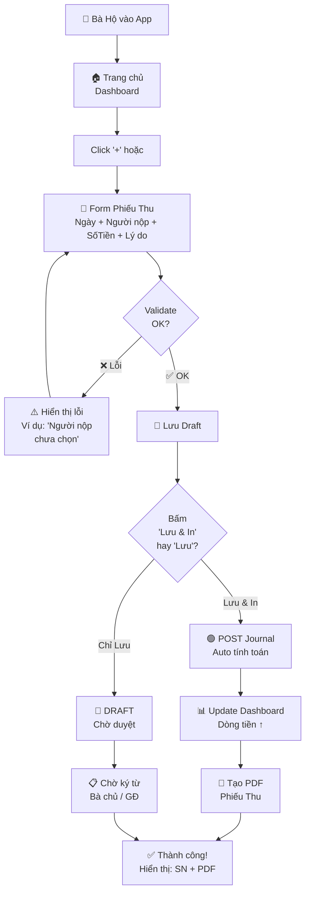
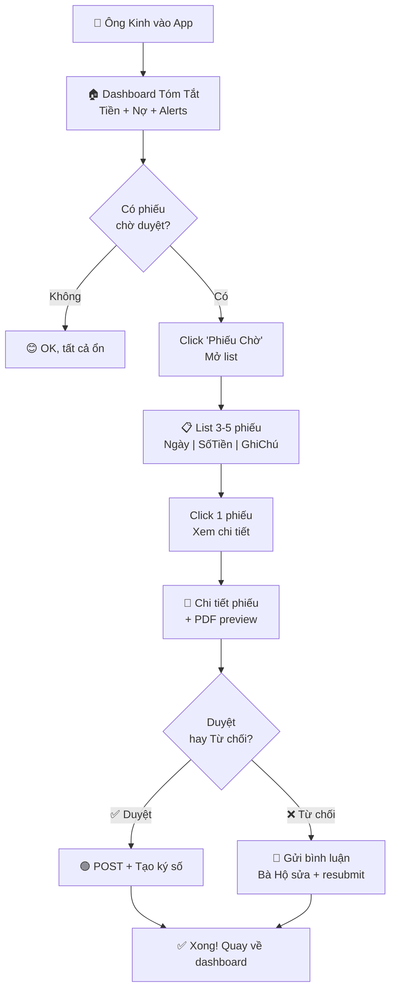

# 📱 ACCHM - Phần Mềm Kế Toán Tinh Gọn (Minimal Accounting)
## One-Page Design Document v1.0

**Ngày:** 28/02/2026  
**Tác giả:** Product Manager (Đóng vai theo tiêu chí: 20+ năm ERP tại SAP/MS)  
**Trạng thái:** Ready for Design & Development Phase

---

## A. USER PERSONA & PSYCHOGRAPHICS

### 👥 **Primary Persona: "Bà Hộ - SME Accountant"**

| Yếu Tố | Chi Tiết |
|--------|---------|
| **Tuổi / Kinh Nghiệm** | 35-50 tuổi, 5-15 năm kiểm soát sổ sách nhỏ |
| **Kỹ năng Công Nghệ** | Cơ bản: Excel, Word, không sợ học cái mới nếu dễ |
| **Máy Tính Chính** | Laptop/Desktop tại văn phòng, đôi khi điện thoại di động |
| **Nỗi Sợ Chính** | **"Tôi sẽ làm sai sổ sách không?"** → Cần khả năng hoàn tác, lịch sử thay đổi, approve workflow |
| **Giá Trị Cảm Giác** | An toàn, tin cậy, rõ ràng, không phức tạp |
| **Mục Tiêu Cuộc Ngày** | - Ghi phiếu thu/chi nhanh trong ngày <br/> - Biết chính xác tiền mặt hiện tại <br/> - Tạo báo cáo sạch sẽ để Giám đốc ký |
| **Jobs to be Done** | 1. Nhập phiếu thu/chi <br/> 2. Kiểm tra dòng tiền <br/> 3. Xuất báo cáo chuyên nghiệp |

### 👥 **Secondary Persona: "Ông Kinh - SME Founder/CEO"**

| Yếu Tố | Chi Tiết |
|--------|---------|
| **Tuổi / Kinh Nghiệm** | 35-55 tuổi, tay nghề kinh doanh, không biết kế toán |
| **Kỹ năng Công Nghệ** | Sơ cấp: dùng email, smartphone, không copy-paste code |
| **Máy Tính Chính** | Smartphone khi đi, đôi khi bàn desktop |
| **Nỗi Sợ Chính** | **"Công ty tôi bóp nợ bao nhiêu? Còn tiền không?"** → Cần dashboard tóm tắt rõ, không cần chi tiết |
| **Giá Trị Cảm Giác** | Nhanh gọn, an tâm, chuyên nghiệp, hiện đại |
| **Mục Tiêu Cuộc Ngày** | - Xem quick dashboard tiền, nợ, khách hàng nợ <br/> - Duyệt & ký phiếu <br/> - Xuất báo cáo gửi ngân hàng/thuế |
| **Jobs to be Done** | 1. Dashboard tóm tắt 3-5 số liệu quan trọng <br/> 2. Duyệt phiếu nhanh <br/> 3. Xuất PDF chuyên nghiệp |

---

## B. THE "MAGIC MOMENT" - CORE UX FLOW

### 🎯 **Scenario: "Phiếu Thu Siêu Nhanh"**

**Bối cảnh:** Sáng thứ 2, khách hàng **ABC Ltd** thanh toán **50,000,000 VND** cho hóa đơn tháng trước.

**Dòng chảy trong 30 giây:**

```
1. Bà Hộ mở App → Click nút "+" (Phiếu Thu) [1 giây]
   ↓
2. Form tối thiểu 3 trường:
   ☐ Ngày: 28/02/2026 [auto = hôm nay]
   ☐ Người nộp: ABC Ltd [memo/dropdown tìm kiếm]
   ☐ Số tiền: 50,000,000 [tự động định dạng 50,000,000]
   ☐ Lý do: Thanh toán HĐ tháng 2 [memotext]
   [5 giây]
   ↓
3. Click "Lưu & In" → Xong [1 giây]
   ↓
4. ✨ Magic:
   - Hệ thống TỰ ĐỘNG:
     📊 Dashboard Dòng Tiền nhập số: 50,000,000 VND
     🧾 PDF Phiếu Thu được tạo (sẵn sàng in)
     📋 Sổ Tiền Mặt cập nhật
     🔗 Công nợ khách hàng giảm
   [instant, không chờ]
   ↓
5. In phiếu → Bà Hộ ký + giao cho khách hàng

⏱ Tổng thời gian: ~30 giây (so với 5-10 phút với phần mềm truyền thống)
😄 Cảm giác: "Wa! Nhanh quá đi mẹ ơi!"
```

### 🎯 **Scenario: "Dashboard Tóm Tắt - Chúng Tôi Có Bao Nhiêu Tiền?"**

**Người dùng:** Ông Kinh (Founder)  
**Thời gian:** 2 phút sáng hôm nay, trước khi bước vào phòng họp

```
Mở App → Trang chủ hiển thị (không cần scroll):

┌─────────────────────────────────────────┐
│     AQUA FAST - Kế Toán Tinh Gọn        │
│                                         │
│  Hôm Nay: 28 Tháng 02 | Công ty: ABC    │
│                                         │
│  ┌──────────────┬──────────────────┐   │
│  │ 💰 Tiền Mặt  │  1,250,000,000   │   │ ← Số tiền mặt hiện tại
│  │   VND        │  (Tăng 35%)      │   │
│  └──────────────┴──────────────────┘   │
│                                         │
│  ┌──────────────┬──────────────────┐   │
│  │ 📈 Khách Hàng│   850,000,000    │   │ ← Tổng công nợ phải thu
│  │   Nợ VND     │  (↑ từ 15 ngày)  │   │
│  └──────────────┴──────────────────┘   │
│                                         │
│  ┌──────────────┬──────────────────┐   │
│  │ 📉 Phải Trả  │   320,000,000    │   │ ← Tổng công nợ phải trả
│  │   VND        │  (↓ từ tuần trước)│  │
│  └──────────────┴──────────────────┘   │
│                                         │
│  ┌──────────────────────────────────┐  │
│  │ 🔔 Hành động cần làm:             │  │
│  │  • 3 khách hàng quá hạn           │  │
│  │  • 1 phiếu chờ duyệt              │  │
│  └──────────────────────────────────┘  │
│                                         │
│  [Xem Chi Tiết] [Lập Phiếu Thu] [...]  │
└─────────────────────────────────────────┘

⏱ Thời gian: Đã hiểu rõ tình hình trong < 10 giây
😊 Cảm giác: "OK, chúng ta ổn lành rồi. Đi họp được."
```

---

## C. CORE USER FLOW (MINIMAL VERSION)

### **2.1 Happy Path: Lập Phiếu Thu**



### **2.2 Happy Path: Xem Dashboard & Duyệt Phiếu**



---

## D. UI COMPONENTS BREAKDOWN

### **D.1 Layout Tổng Thể (Design System)**

```
┌──────────────────────────────────────────────┐
│  📌 Top Bar: Logo | Công ty | 👤 User | ⚙️  │  ← Minimalist header
├──────────────┬──────────────────────────────┤
│              │                              │
│  🧭 Sidebar  │     💡 MAIN CONTENT          │
│  (Collapse)  │     (Flexible width)         │
│              │                              │
│  • Dashboard │     Nội dung thay đổi        │
│  • Phiếu Thu │     theo route               │
│  • Phiếu Chi │                              │
│  • Báo Cáo   │                              │
│  • Cài Đặt   │                              │
│              │                              │
│  📱 Mobile:  │                              │
│  Sidebar →   │                              │
│  Hamburger   │                              │
└──────────────┴──────────────────────────────┘
```

**Colors (Design Tokens):**
- **Background:** #FFFFFF (or light #F8F9FA for sections)
- **Text Primary:** #1A1A1A (dark gray)
- **Text Secondary:** #666666 (medium gray)
- **Accent (Primary):** #0066CC (Blue - Trust & Safety)
- **Accent (Success):** #00AA00 (Green - Positive)
- **Accent (Warning):** #FF9900 (Orange - Action needed)
- **Accent (Danger):** #DD0000 (Red - Errors)
- **Borders:** #E0E0E0 (light gray)
- **Spacing:** 8px / 16px / 24px / 32px (8px grid)

### **D.2 Component Library (Inventory)**

| Component | Mô Tả | Ưu Tiên |
|-----------|-------|---------|
| **Button** | Primary (Blue), Secondary, Danger | ⭐⭐⭐ |
| **Input/Textarea** | Text, Number, Date, Select (autocomplete) | ⭐⭐⭐ |
| **Card** | Container với padding & border | ⭐⭐⭐ |
| **Table** | List phiếu, read-only hoặc edit-inline | ⭐⭐⭐ |
| **Modal/Dialog** | Confirm, Alert | ⭐⭐ |
| **Toast/Notification** | Success, Error, Warning | ⭐⭐⭐ |
| **Badge** | Status (DRAFT, POSTED, PENDING) | ⭐⭐ |
| **Skeleton Loader** | Loading state sạch sẽ | ⭐⭐ |
| **Breadcrumb** | Navigation trail | ⭐ |
| **Pagination** | Tiếp tục cho list dài | ⭐⭐ |

### **D.3 Phiếu Thu Form - Anatomy**

```
┌────────────────────────────────────────────────────┐
│ 📝 Lập Phiếu Thu                            [X]    │
├────────────────────────────────────────────────────┤
│                                                    │
│ 1️⃣ Ngày Phiếu                                    │
│    ┌────────────────────────────────────────────┐ │
│    │ 28/02/2026                           🗓️   │ │ ← DatePicker
│    └────────────────────────────────────────────┘ │
│                                                    │
│ 2️⃣ Người Nộp (Khách Hàng / Đối Tượng)           │
│    ┌────────────────────────────────────────────┐ │
│    │ ABC Ltd (id: KH001)              🔍        │ │ ← Autocomplete
│    └────────────────────────────────────────────┘ │
│    💡 Gợi ý: Chưa có? Tạo nhanh                  │
│                                                    │
│ 3️⃣ Số Tiền                                       │
│    ┌────────────────────────────────────────────┐ │
│    │ 50,000,000                         VND    │ │ ← Number format
│    └────────────────────────────────────────────┘ │
│    💡 Ký tự hợp lệ: 0-9, "."                    │
│                                                    │
│ 4️⃣ Lý Do / Ghi Chú                              │
│    ┌────────────────────────────────────────────┐ │
│    │ Thanh toán HĐ tháng 2/2026                 │ │ ← Textarea
│    │                                            │ │
│    └────────────────────────────────────────────┘ │
│                                                    │
│ 🔗 [Hợp Đồng / Tệp Đính Kèm]  [Add File +]      │
│                                                    │
├────────────────────────────────────────────────────┤
│ [Lưu & In PDF]  [Lưu]  [Hủy]                     │
└────────────────────────────────────────────────────┘

✅ Validation Rules:
  • Ngày: không được > hôm nay
  • Người nộp: bắt buộc (hoặc cho phép "Khác")
  • Số tiền: > 0, ≤ 999,999,999,999
  • Lý do: tối thiểu 3 ký tự
```

### **D.4 Dashboard Components**

```
┌─────────────────────────────────────────────────┐
│ 📊 Dashboard - Tóm Tắt Tài Chính               │
├─────────────────────────────────────────────────┤
│                                                 │
│ 🎯 KPI Cards (3 in a row on desktop)            │
│   ┌──────────┐  ┌──────────┐  ┌──────────┐    │
│   │  💰      │  │  📈      │  │  📉      │    │
│   │ Tiền     │  │ Phải Thu │  │ Phải Trả │    │
│   │ 1.25B    │  │ 850M     │  │ 320M     │    │
│   │ ↑35%     │  │ ↑15d ago │  │ ↓1w ago  │    │
│   └──────────┘  └──────────┘  └──────────┘    │
│                                                 │
│ 📋 Top 5 Alerts & Actions                      │
│   🔴 3 khách hàng quá hạn (XYZ nợ 500M)      │
│   🟡 2 phiếu chờ duyệt từ sáng                │
│   🟢 Tiền mặt đủ cho tháng này                │
│                                                 │
│ 📊 Mini Chart: Dòng Tiền 30 Ngày (optional)   │
│   [Line chart - 30 ngày gần nhất]              │
│                                                 │
│ 🔥 Quick Actions                               │
│   [+ Phiếu Thu]  [+ Phiếu Chi]  [Xem Báo Cáo] │
│                                                 │
└─────────────────────────────────────────────────┘
```

---

## E. HỢP ĐỒNG CAM KẾT (CONTRACT OF SUCCESS)

### **🎯 3 Điều PHẢI ĐẠT (Must-Have)**

#### **1️⃣ Phiếu Thu/Chi ≤ 30 Giây - Siêu Tối Giản**
- ✅ Form chỉ có 4 trường (Ngày, Người, Số tiền, Lý do)
- ✅ Tất cả validate client-side → instant feedback
- ✅ Auto-fill ngày hôm nay, mặc định tài khoản
- ✅ **Không có** hiển thị "Journal Entry Lines" hay "GL Account Mapping" → Người dùng không cần xem
- ⚙️ Backend tự động sinh Journal Entry + GL posting (user không biết)

#### **2️⃣ Dashboard Số Xanh/Đỏ - Hiểu Ngay Lập Tức**
- ✅ Trang chủ hiển thị ≤ 5 KPI chính (Tiền, Nợ thu, Nợ trả, Mục tiêu)
- ✅ Mỗi KPI có mũi tên [↑/↓] so với kỳ trước (rõ ràng, không cần tooltip)
- ✅ Màu sắc: Xanh = Tốt, Đỏ = Cần action, Vàng = Cào cây
- ✅ Load time ≤ 2 giây (không chờ)
- ✅ "Phiếu chờ duyệt" & "Khách hàng quá hạn" được top highlight

#### **3️⃣ Xuất PDF Phiếu - Chuyên Nghiệp & Ngay Tức Thì**
- ✅ Phiếu Thu/Chi PDF xuất với header (logo công ty, thông tin công ty)
- ✅ Footer có ký số hoặc mã QR (nếu POST thành công)
- ✅ Định dạng: Tiêu đề rõ, số phiếu, người ký, ngày (giống giấy tờ ngân hàng)
- ✅ Download ngay sau khi "Lưu & In" (< 2 giây), không cần refresh
- ✅ Hỗ trợ in trực tiếp từ app (nếu device có printer)

---

### **🚫 3 Điều KHÔNG ĐƯỢC LÀM (Must-Not)**

#### **❌ 1. Không Hiển Thị Chi Tiết Kế Toán Phức Tạp**
- ❌ Không bắt buộc user chọn "Debit Account" vs "Credit Account"
- ❌ Không cho thấy "Journal Entry Lines", "GL Postings", "Account Balances"
- ❌ Không hiển thị "Multiple currencies", "Exchange rates" ở form chính
  - → Backend xử lý tất cả, auto-map theo config công ty
  - → Advanced setting ở phần "Cài đặt Công ty"

#### **❌ 2. Không Workflow Phức Tạp / Multi-Approval**
- ❌ Không bắt duyệt từ 3-4 người khác nhau
- ❌ Không có "Comment threads" hay "Task assignment" ở phiếu
  - → Simple workflow: Draft → Review → Posted (max 2 bước)
  - → Nếu từ chối: edit & resubmit (không cần email loop)

#### **❌ 3. Không Overload Tính Năng Không Ai Dùng**
- ❌ Không tích hợp "AR/AP Aging" ở v1.0 (có ở v2)
- ❌ Không "Budget vs Actual" ở dashboard (v2)
- ❌ Không "Multi-entity consolidation" (v3)
- ❌ Không "Advanced reconciliation" (v2)
  - → Focus: 80% use case, 5% UI, làm tốt, không hài hước

---

## F. SUCCESS METRICS (CÁCH ĐÁNH GIÁ THÀNH CÔNG)

| Metric | Target | How to Measure |
|--------|--------|---|
| **Time to Create Receipt** | ≤ 30 giây | Stopwatch (hỏi 5 users) |
| **Dashboard Load Time** | ≤ 2 giây | DevTools Network tab |
| **User Confidence** (survey) | ≥ 8/10 "An tâm" | Post-use NPS |
| **PDF Generation** | ≤ 2 giây | Measure API latency |
| **Error Rate** | < 1% submit lỗi | Monitor logs |
| **Mobile Usability** | ≥ 4/5 (iPhone) | Manual test |

---

## G. TECHNICAL ARCHITECTURE ALIGNMENT

### **G.1 Dự Kiến Dùng Stack Hiện Có**

```
Frontend:
  - Next.js Pages → /app/cash-receipts/
  - React Components → src/components/cash/ReceiptForm.tsx
  - Tailwind CSS → Styling (sạch sẽ, minimalist)
  - React Hook Form → Form validation
  - zustand / Context → State management (Dashboard + Sidebar)

Backend:
  - Next.js API Routes → /api/cash-receipts/
  - Prisma ORM → Query CashReceipt, Partner, Account, Journal
  - TypeScript → Type-safe
  - Existing Services:
    ✅ cashReceipt.service.ts → CRUD + auto Journal Entry
    ✅ journalEntry.service.ts → POST Journal
    ✅ partner.service.ts → Khách hàng lookup
    ✅ numberSequence.service.ts → Tạo receipt number

Database:
  - SQL Server (existing)
  - Schema:
    ✅ CashReceipt table (receiptNumber, date, amount, partnerId, status)
    ✅ CashReceiptDetail table (nếu multi-line)
    ✅ JournalEntry table (auto-generated)
    ✅ Partner table (người nộp)

PDF Generation:
  - Library: `pdfkit` hoặc `html2pdf` (kiến đề xuất: pdfkit vì lightweight)
OR
  - puppeteer / playwright (nếu template phức tạp)
  - Store PDF ở `/public/receipts/` hoặc cloud (S3)

Deployment:
  - Vercel (nếu dùng Next.js)
  - Docker + Azure Container (nếu enterprise)
```

### **G.2 API Endpoints to Build/Enhance**

```typescript
// 1. RECEIPT CRUD
POST   /api/cash-receipts                    // Create
GET    /api/cash-receipts?page=1&limit=20    // List
GET    /api/cash-receipts/:id                // Get one
PATCH  /api/cash-receipts/:id                // Update (DRAFT only)
DELETE /api/cash-receipts/:id                // Delete (DRAFT only)
POST   /api/cash-receipts/:id/post           // Transition to POSTED
POST   /api/cash-receipts/:id/pdf            // Generate & fetch PDF

// 2. DASHBOARD DATA
GET    /api/dashboard/summary                // { cashTotal, receivable, payable }
GET    /api/dashboard/alerts                 // { pendingApprovals, overduePartners }
GET    /api/dashboard/cashflow-30d           // { dates: [], amounts: [] }

// 3. PARTNER LOOKUP
GET    /api/partners?search=ABC&limit=10     // Autocomplete
POST   /api/partners/quick-add               // Create on-the-fly

// 4. SETTINGS
GET    /api/company/:id/settings             // Default accounts, workflow
PATCH  /api/company/:id/settings             // Update
```

---

## H. PHASED ROLLOUT PLAN

### **Phase 1: MVP (v1.0) - 6-8 tuần**
- ✅ Cash Receipt form (4 fields)
- ✅ Dashboard KPI (3 cards)
- ✅ PDF generation
- ✅ Basic list view
- ✅ RBAC: Admin + Accountant role

### **Phase 2: Polish (v1.1) - 2-3 tuần**
- ✅ Cash Payment form (mirror of Receipt)
- ✅ Mobile responsive
- ✅ Dark mode toggle
- ✅ Batch import (CSV)
- ✅ Email notification on approval

### **Phase 3: Expansion (v2.0) - Q3 2026**
- ✅ Invoicing (Sales + Purchase)
- ✅ AR/AP aging report
- ✅ General Ledger viewer
- ✅ Multi-currency
- ✅ Bank reconciliation

---

## I. WIREFRAME / MOCKUP REFERENCE

### **I.1 Phiếu Thu Form (Desktop)**

```
╔═════════════════════════════════════════════════════════╗
║ 📝 Lập Phiếu Thu                                    [X] ║
╠═════════════════════════════════════════════════════════╣
║                                                         ║
║ Ngày: [28/02/2026 📅]  Mã đơn vị: [ABC]               ║
║                                                         ║
║ Người Nộp:                                              ║
║ ┌───────────────────────────────────────────────────┐  ║
║ │ ABC Ltd (KH001) - tìm kiếm... 🔍                  │  ║
║ └───────────────────────────────────────────────────┘  ║
║                                                         ║
║ Số Tiền:                                                ║
║ ┌───────────────────────────────────────────────────┐  ║
║ │ 50,000,000  │ VND ↓                               │  ║
║ └───────────────────────────────────────────────────┘  ║
║                                                         ║
║ Lý Do / Ghi Chú:                                        ║
║ ┌───────────────────────────────────────────────────┐  ║
║ │ Thanh toán HĐ tháng 2/2026                        │  ║
║ │                                                   │  ║
║ │                                                   │  ║
║ └───────────────────────────────────────────────────┘  ║
║                                                         ║
║ Tệp đính kèm: [📎 Thêm file +]                         ║
║                                                         ║
╠═════════════════════════════════════════════════════════╣
║ [✅ Lưu & In PDF] [💾 Lưu] [❌ Hủy]                    ║
╚═════════════════════════════════════════════════════════╝
```

### **I.2 Dashboard (Mobile Portrait - Ông Kinh Check Nhanh)**

```
╔════════════════════════════════════╗
║ 📱 AQUA FAST - Kế Toán Tinh Gọn   ║
├────────────────────────────────────┤
║ 📍 28 Tháng 02 | ABC Ltd            ║
├────────────────────────────────────┤
║                                    ║
║  ┌──────────────────────────────┐ ║
║  │ 💰 Tiền Mặt                 │ ║
║  │ 1.25 Tỷ VND                 │ ║
║  │ ↑ 35% (từ hôm trước)         │ ║
║  └──────────────────────────────┘ ║
║                                    ║
║  ┌──────────────────────────────┐ ║
║  │ 📈 Khách Hàng Nợ             │ ║
║  │ 850 Triệu VND                │ ║
║  │ ↑ (3 khách hàng quá hạn)     │ ║
║  └──────────────────────────────┘ ║
║                                    ║
║  ┌──────────────────────────────┐ ║
║  │ 📉 Phải Trả Nhà Cung Cấp     │ ║
║  │ 320 Triệu VND                │ ║
║  │ ↓ (OK, còn 10 ngày)          │ ║
║  └──────────────────────────────┘ ║
║                                    ║
║ 🔔 Cần xử lý ngay:                 ║
║  ✓ 1 phiếu chờ ký từ Bà Hộ       ║
║  ✓ 2 khách hàng gọi nhắc nợ      ║
║                                    ║
║ [+ Phiếu Thu] [Xem Báo Cáo]       ║
║                                    ║
╚════════════════════════════════════╝
```

---

## J. APPROVAL & SIGN-OFF

| Role | Name | Date | Signature |
|------|------|------|-----------|
| **Product Manager** | (AI - SAP Mentality) | 28/02/2026 | ✅ |
| **Engineering Lead** | [TBD] | / | [ ] |
| **Founder / CEO** | [Your Name] | / | [ ] |
| **UX Designer** | [TBD] | / | [ ] |

---

## K. FAQs & NOTES

**Q: Tại sao chỉ 4 trường cho Phiếu Thu?**  
A: Vì Bà Hộ không cần biết "Debit vs Credit" hay "Account Mapping". Hệ thống tự động xử lý dựa trên cấu hình (Phiếu Thu = Debit TK Tiền, Credit TK Khác). Simple = bền vững + ít lỗi.

**Q: Nếu Bà Hộ nhập sai, sao không được sửa sau khi in?**  
A: Draft có thể sửa. Sau khi POST (published), chỉ có thể "Reverse" (tạo phiếu bù). Vì vậy form dễ → Bà Hộ kiểm tra trước khi lưu.

**Q: PDF được lưu ở đâu?**  
A: Nên lưu ở `/public/uploads/receipts/{companyId}/{year}/{month}/` và có link download ở detail. Nếu cloud (S3), tốt hơn (backup + CDN).

**Q: Có hỗ trợ Tiếng Anh hay Tiếng Nhật không?**  
A: v1.0 Tiếng Việt. v1.1 hỗ trợ i18n (dùng existing `messages/` folder). UI được viết generic (dùng translation keys).

**Q: Ông Kinh muốn xem báo cáo Chi Tiết giống Excel?**  
A: Đó là Phase 3 (General Ledger). v1.0 chỉ focus Dashboard tóm tắt + list phiếu.

---

## ✅ CONCLUSION

Phiếu Tài Liệu này định rõ **một phần mềm kế toán tinh gọn** dành cho SME, với:
- 🎯 **Magic Moment rõ ràng**: Phiếu Thu ≤ 30 giây
- 💎 **UX sạch sẽ**: 4 trường, 0 phức tạp
- 🚀 **Khả năng thực hiện**: Dùng stack hiện tại, không cần công nghệ mới
- ✅ **Success Criteria rõ ràng**: Dashboard + PDF + Validate ổn

**Sẵn sàng bước vào Design & Development Phase! 🎉**

---

*Document Prepared By: Product Manager (SAP/Microsoft ERP Veteran)*  
*Version: 1.0*  
*Last Updated: 28/02/2026*
