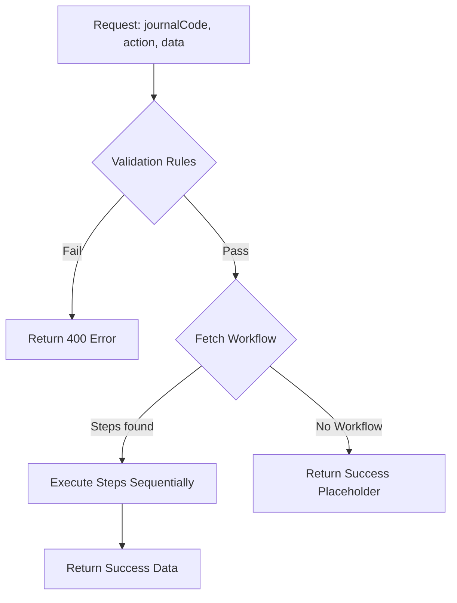

# Voucher Execution Engine

The Voucher Engine is the heart of the ACCHM accounting system. It provides a dynamic, metadata-driven way to handle complex accounting transactions.

## Endpoint: `/api/vouchers/execute`

This is a **Master POST endpoint** that accepts a `journalCode`, an `action`, and the payload `data`.

### Action Flow

## 1. Dynamic Validation (`Sys_VoucherRule`)
Before any action, the engine runs JS-based validation rules stored in the database.
- **Condition**: A stringified JavaScript expression (e.g., `data.amount > 0`).
- **Evaluation**: Run in a sandbox-like environment using `new Function`.

## 2. Workflow Steps (`Sys_VoucherWorkflow`)
Workflows allow different vouchers to have different processing pipelines without changing the API code.

### Step Types
- `INSERT_RECEIPT`: Calls standard service methods for Create/Update/Delete.
- `CALL_SP`: Delegates logic to a Stored Procedure in SQL Server (used for complex accounting calculations).
- `GL_POST`: (Future) Triggers General Ledger posting.

## 3. Benefits
- **Flexibility**: Define validation logic in DB without redeploying code.
- **Standardization**: All vouchers follow the same security and logging patterns.
- **Traceability**: Unified entry point for auditing actions.

## Service Integration Pattern
Services in `src/services/` should expose a consistent interface:
- `createEntity(data)`
- `updateEntity(id, data)`
- `deleteEntity(id)`
- `postEntity(id)`

> [!IMPORTANT]
> Always use `prisma.$transaction` when updating multiple tables (e.g., Voucher header and Journal Entry) to prevent "orphaned" records if an error occurs.
