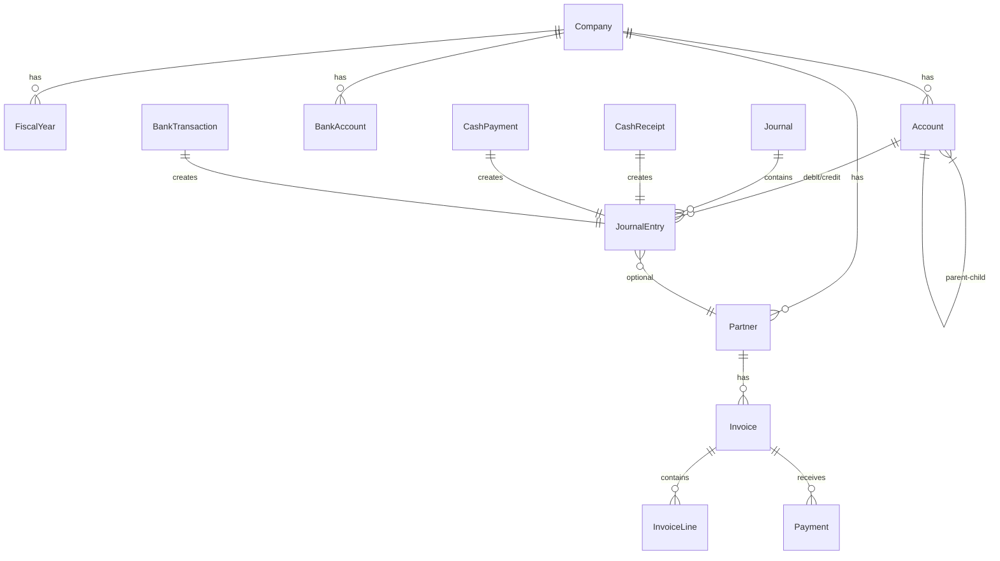

# Plan: ERP Accounting Module (Kế Toán)

**Created:** 2026-01-20 21:45  
**Status:** 🟡 In Progress  
**Brief:** [docs/BRIEF.md](file:///Users/timo/Downloads/awf-main/acchm/docs/BRIEF.md)

---

## Overview

Xây dựng Module Kế Toán MVP cho hệ thống ACCHM ERP, bao gồm các phân hệ:
- Hệ thống tài khoản (Chart of Accounts) ✅ Đã có cơ bản
- Nhật ký chung + Sổ cái (Journal & General Ledger)
- Quản lý tiền mặt (Cash Management)
- Quản lý tiền gửi ngân hàng (Bank Management)
- Kế toán phải thu (Accounts Receivable)
- Kế toán phải trả (Accounts Payable)
- Báo cáo tài chính cơ bản (Financial Reports)

---

## Tech Stack

| Layer | Technology |
|-------|------------|
| **Frontend** | Next.js 13.5 (App Router) |
| **UI** | Tailwind CSS + Custom Components |
| **Backend** | Next.js API Routes |
| **Database** | MS SQL Server (via Docker) |
| **ORM** | Prisma 5.22 |
| **i18n** | next-intl (VN, EN, JA, KO) |

---

## Phases

| Phase | Name | Status | Tasks | Est. Sessions |
|-------|------|--------|-------|---------------|
| 01 | Database Schema | ✅ Complete | 15 | 2 |
| 02 | Core Accounting (Journal/GL) | ⬜ Pending | 18 | 3 |
| 03 | Cash & Bank Management | ⬜ Pending | 14 | 2 |
| 04 | Accounts Receivable (AR) | ⬜ Pending | 16 | 2 |
| 05 | Accounts Payable (AP) | ⬜ Pending | 14 | 2 |
| 06 | Financial Reports | ⬜ Pending | 12 | 2 |
| 07 | System & Security | ⬜ Pending | 10 | 1 |
| 08 | Testing & Polish | ⬜ Pending | 8 | 1 |

**Tổng:** ~107 tasks | Ước tính: 15 sessions

---

## Database Schema Overview



---

## Quick Commands

```bash
# Start Phase 1 (Database Schema)
/code phase-01

# Check progress
/next

# Save context
/save-brain

# Run development server
cd acchm && npm run dev
```

---

## Progress Log

| Date | Phase | Action | Notes |
|------|-------|--------|-------|
| 2026-01-20 | - | Created plan | Initial planning |
| 2026-01-20 | 01 | ✅ Complete | 22 tables, 172 accounts, 7 journals |

---

## Notes

- Project đã có sẵn model `Account` cho Chart of Accounts
- Cần mở rộng schema cho các phân hệ khác
- Multi-language đã được setup (next-intl)
- Database sử dụng Docker container (MS SQL)
